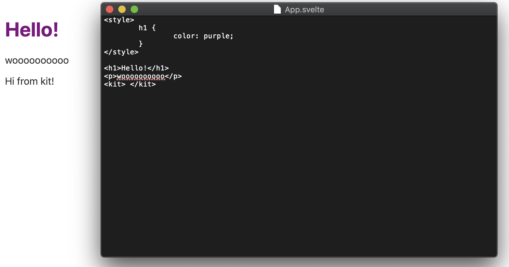
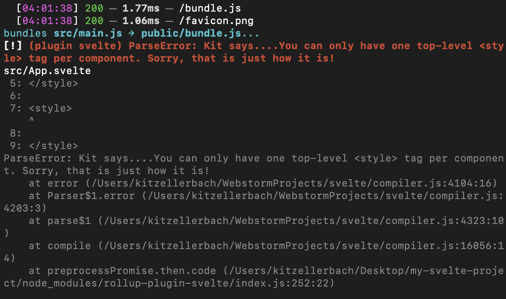
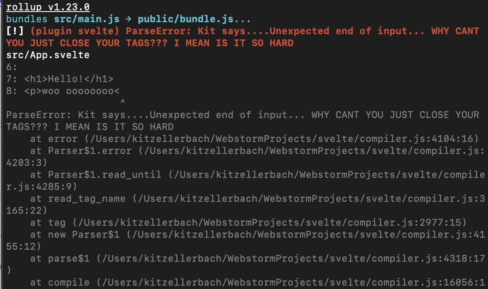

Assignment 5 - Databases and/or Components
===

(1) My assignment 2,3 and 4 all use NoSQL databases.

- A2 uses Firebase
- A3 uses MongoDB
- A4 uses MongoDB
    
(2/3) The client for A3/A4 is very far along, and given the week we had for this assignment I decided against re-coding the entire thing in react.

Thus, for this assignment I completed two things:

1. I continued working on an app called 'Logos' I use to hold all my poetry and writings.
 https://kitzeller.github.io/logos/ 
2. I downloaded the svelte repository and modified it, using `npm run dev` and `npm link` to test it locally. 

I added a <kit></kit> tag that says "Hi from kit!"

I added some more interesting custom error messages. Also, "Kit says..." will appear in front of every error message.

Include a very brief summary of your project here and what you changed / added to assignment #3. Briefly (3–4 sentences) answer hte folloiwn question: did the new technology improve or hinder the development experience?
