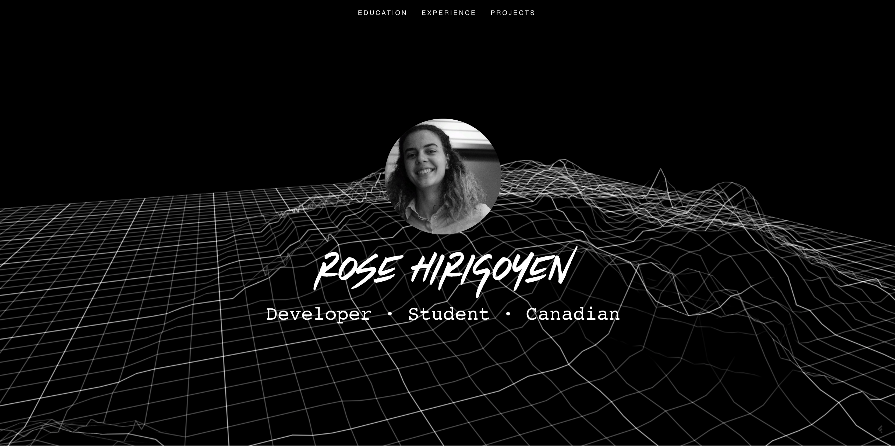

Assignment 5 - Databases and/or Components
===

(1) My assignment 2,3 and 4 all use NoSQL databases.

- A2 uses Firebase
- A3 uses MongoDB
- A4 uses MongoDB
    
(2/3) The client for A3/A4 is very far along, and given the week we had for this assignment I decided against re-coding the entire thing in react.
I also talked to charlie about this.

Thus, for this assignment I completed two things:

(1) I created a personal portfolio in React for my teammate, Rose, from my internship this summer at Microsoft.
It uses inspiration from the design of my A1 assignment.

https://a5-kitzeller.glitch.me/

I definitely enjoyed using React. I've used it a little before, and really appreciate the modularity, which reminds me a lot
of angular. I also like how it can be used to make great template sites for people who might not have as much or any
web programming experience. For instance, I designed Rose's website in such a way that she only needs to add her information to the `resume_data.js` 
file, which is just a big object, and the website will populate itself based on that information. The code reduction is also insane - rather than having to
create a bunch of divs, I can just use the `map` function to create them based on the data. I'm also a huge fan of the single responsibility principle in OOAD,
so having parts of the site as individual components makes me happy.

The code is in the `rose-website` directory.

(2) I downloaded the svelte repository and modified it, using `npm run dev` and `npm link` to test it locally. The code is in the `svelte` directory.
I also added the compiled version of my changes, `compiler.js`.

I added a <kit></kit> tag that says "Hi from kit!"

I added some more interesting custom error messages. Also, "Kit says..." will appear in front of every error message.

